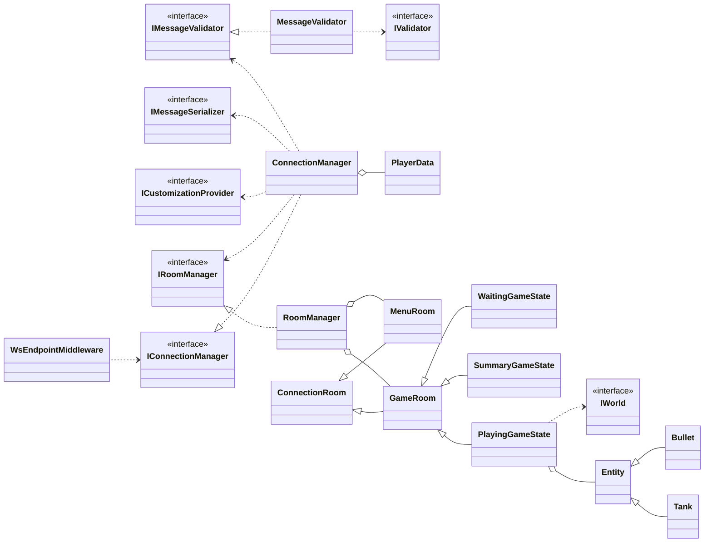

# Tanks - online real-time multiplayer game 🎮


## Task 🏫
### Requirements 📝
This project was created for the *Script Languages* university course. The goal was to create an advanced Python application, following these requirements:
- In the case of a full-stack application, Python should cover as much of the codebase as possible.
- It should follow the rules of [SOLID](https://en.wikipedia.org/wiki/SOLID), [DRY](https://en.wikipedia.org/wiki/Don%27t_repeat_yourself), [CQS](https://en.wikipedia.org/wiki/Command%E2%80%93query_separation), and [POLA](https://en.wikipedia.org/wiki/Principle_of_least_astonishment).
- The project should be a usable product and it should be useful for an end user (see **Motivation**).
- The project must contain a (preferably graphical) user interface.
- It should use tools that make deployment easier (e.g. Docker, setuptools, build script).
- It must use a [VCS](https://en.wikipedia.org/wiki/Version_control).

### Motivation 💪
The main goal of this application was to create a multiplayer game, that can be played with friends, is free, uses three-dimensional effects, can be played from any device, and can be installed in seconds. Surprisingly, there aren't many such games on the market. An obvious solution to the last two points was to create a web app. A website can be accessed from any device and doesn't need any installation at all.

## Further work 🚀
After submitting the project, I decided to rebuild it using C#. The choice of Python as the game's main backend language proved to be problematic in terms of performance, safety (caused by lack of static typing), and readability. That's why this repository mainly consists of C# code.

If you want to see the previous Python version, check the repository at the time of [v1.0.0](https://github.com/tchojnacki/scripting-tanks/tree/v1.0.0) ([the "Deadline" release](https://github.com/tchojnacki/scripting-tanks/releases/tag/v1.0.0)).

## Technology 🔧
### Backend ⚙️
- [C# 10](https://learn.microsoft.com/en-us/dotnet/csharp/)
- [.NET 6.0](https://dotnet.microsoft.com/en-us/)
- [ASP.NET](https://dotnet.microsoft.com/en-us/apps/aspnet)
- [MediatR](https://github.com/jbogard/MediatR)
- [FluentValidation](https://docs.fluentvalidation.net/en/latest/)

### Frontend 🖥️
- [TypeScript 4.6](https://www.typescriptlang.org/)
- [React](https://reactjs.org/) + [Immer](https://github.com/immerjs/immer)
- [Three.js](https://threejs.org/) + [React Three Fiber](https://github.com/pmndrs/react-three-fiber) + [React Three Drei](https://github.com/pmndrs/drei)
- [Mantine](https://mantine.dev/) + [Tabler Icons React](https://www.npmjs.com/package/tabler-icons-react)
- [Lodash](https://lodash.com/)

### Tooling 🧰
- [Docker](https://www.docker.com/)
- [Git](https://git-scm.com/) + [GitHub Actions](https://github.com/features/actions)
- [Vite](https://vitejs.dev/)
- [Prettier](https://prettier.io/)

## Deployment 🚀
Run using Docker Compose:
```bash
docker compose up
```
The app will be available under [localhost:8080](http://localhost:8080/).

Alternatively, run the container from `Dockerfile` yourself.

The app can be deployed to [Heroku](https://www.heroku.com/home) using the *Container* framework through `heroku.yml` & `Dockerfile`. It can also be deployed to [Fly.io](https://fly.io), using the provided `fly.toml` file. While not supported, it should be possible to also run the production mode without Docker, if your software versions are correct.

## Architecture 🏗
### Authoritative server 🏛️
The game is server-authoritative by design which means the server has a final say over any operation. It stores and computes the locations of all players and is their single source of truth. All of the client messages are validated and it is guaranteed that only legal moves are made, even if a player modifies their client.

### Most important classes 🗺️

