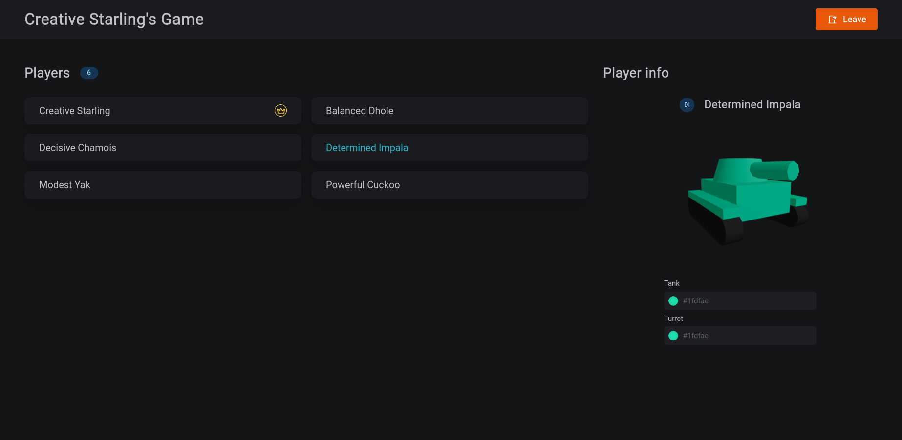

# Tanks - *Script Languages* course final project 🎮


## Task 🏫
### Requirements 📝
This project was created for the *Script Languages* university course. The goal was to create an advanced Python application, following given requirements:
- In case of a full stack application, Python should cover as much of the codebase as possible.
- It should follow the rules of SOLID, DRY, CQS and POLA.
- The project should be a usable product and it should be useful for an end user (see **Motivation**).
- The project must contain a (preferably graphical) user interface.
- It should use tools which make deployment easier (e.g. Docker, setuptools, build script).
- It must use a VCS.

### Motivation 💪
The main goal of this application was to create a multiplayer game, that can be played with friends, which is free, uses three-dimensional effects, can be played from any device and can be installed in seconds. Surprisingly, there aren't many such games on the market. An obvious solution to the last two points was to create a web app. A website can be accessed from any device and doesn't need any installation at all.

## Technology 🔧
### Backend ⚙️
- [Python 3.10](https://www.python.org/)
- [FastAPI](https://fastapi.tiangolo.com/)
- [Uvicorn](https://www.uvicorn.org/)
- [attrs](https://www.attrs.org/en/stable/) + [cattrs](https://github.com/python-attrs/cattrs)
- custom-build websocket message handling ✨

### Frontend 🖥️
- [TypeScript 4.6](https://www.typescriptlang.org/)
- [React](https://reactjs.org/) + [Immer](https://github.com/immerjs/immer)
- [Three.js](https://threejs.org/) + [React Three Fiber](https://github.com/pmndrs/react-three-fiber) + [React Three Drei](https://github.com/pmndrs/drei)
- [Mantine](https://mantine.dev/) + [Tabler Icons React](https://www.npmjs.com/package/tabler-icons-react)
- [Lodash](https://lodash.com/)

### Tooling 🧰
- [Docker](https://www.docker.com/)
- [Git](https://git-scm.com/) + [GitHub Actions](https://github.com/features/actions)
- [Pylint](https://pypi.org/project/pylint/)
- [autopep8](https://pypi.org/project/autopep8/)
- [Vite](https://vitejs.dev/)
- [Prettier](https://prettier.io/)

## Deployment 🚀
### Production 🐳
Run using Docker Compose:
```bash
docker compose up
```
The app will be available under [localhost:8080](http://localhost:8080/).

Alternatively run the container from `Dockerfile` yourself.

The app can be deployed to [Heroku](https://www.heroku.com/home) using *Container* framework through `heroku.yml` & `Dockerfile`.

While not supported, it should be possible to also run the production mode without Docker, after installing dependencies from `requirements.txt` and `package.json`.


### Development 👨‍💻
A development Docker image is provided in the `.devcontainer/Dockerfile`. [Visual Studio Code](https://code.visualstudio.com/) supports those files with the [Remote - Containers](https://marketplace.visualstudio.com/items?itemName=ms-vscode-remote.remote-containers) extension. Once up you can run the server using the `start-dev.sh` script.

While not supported, it should be possible to also run the development mode without Docker, after installing dependencies from `requirements.txt` and `package.json`.

## Architecture 🏗
### Authoritative server 🏛️
The game is server-authoritative by design which means the server has a final say over any operation. It stores and computes locations of all players and is their single source of truth. All of the client messages are validated and it is guaranteed that only legal moves are made, even if a player modifies their client.

### Data flow of `ClientMsg` 📨

